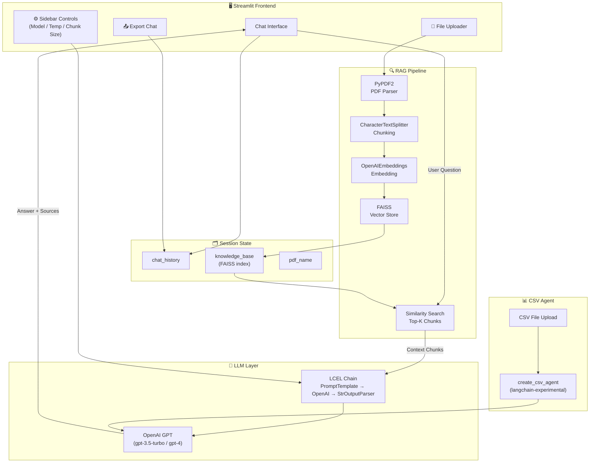
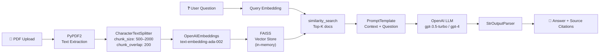
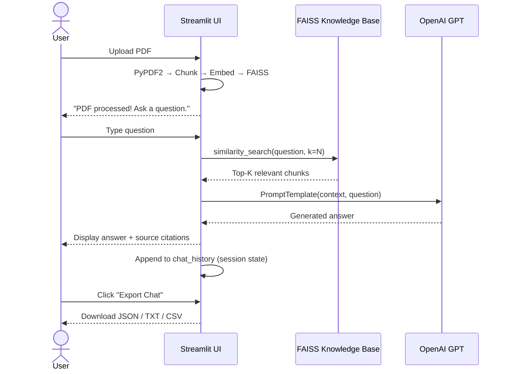
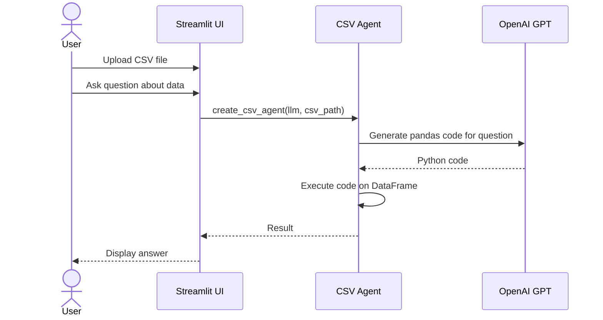

# 🤖 SmartAI ChatBot

<div align="center">


*AI-powered PDF & CSV question-answering chatbot built with Streamlit, LangChain, and OpenAI*

</div>

---

## 📖 Table of Contents

- [Overview](#-overview)
- [Features](#-features)
- [Tech Stack](#-tech-stack)
- [Architecture](#-architecture)
- [RAG Pipeline](#-rag-pipeline)
- [Project Structure](#-project-structure)
- [Setup & Installation](#-setup--installation)
- [Configuration](#-configuration)
- [Usage Guide](#-usage-guide)
- [Data Flow Diagrams](#-data-flow-diagrams)

---

## 🧠 Overview

**SmartAI ChatBot** is an intelligent document Q&A assistant that lets you upload PDF files and ask natural-language questions about their contents. It uses a **Retrieval-Augmented Generation (RAG)** pipeline — splitting documents into chunks, embedding them into a FAISS vector store, and fetching the most relevant context before generating precise answers with GPT-3.5 Turbo or GPT-4.

A companion **CSV Agent** module provides natural-language querying over tabular data files.

---

## ✨ Features

| Feature | Description |
|---|---|
| 📄 PDF Ingestion | Upload and parse multi-page PDFs via PyPDF2 |
| 🔍 Semantic Search | FAISS vector store with OpenAI embeddings for similarity search |
| 🤖 GPT-powered Q&A | LCEL chain with configurable model (gpt-3.5-turbo / gpt-4) |
| 🌡️ Temperature Control | Adjustable creativity slider (0.0 – 1.0) |
| 📊 CSV Agent | Natural-language querying over tabular CSV files |
| 💬 Chat History | Full conversation memory within a session |
| 📤 History Export | Export chat as JSON, TXT, or CSV |
| 🔗 Source Citations | Each answer includes the source chunks used for context |
| ⚙️ Configurable Chunking | Adjustable chunk size (500–2000 tokens) and source count (1–5) |

---

## 🛠️ Tech Stack

### Core Framework
| Layer | Technology |
|---|---|
| UI / Server | Streamlit |
| LLM Orchestration | LangChain (LCEL) |
| LLM Provider | OpenAI (gpt-3.5-turbo, gpt-4) |

### RAG Pipeline
| Component | Technology |
|---|---|
| PDF Parsing | PyPDF2 |
| Text Chunking | LangChain CharacterTextSplitter |
| Embeddings | OpenAIEmbeddings |
| Vector Store | FAISS (faiss-cpu) |
| Output Parsing | LangChain StrOutputParser |

### Data & Utilities
| Component | Technology |
|---|---|
| Tabular Q&A | langchain-experimental CSV Agent |
| Env Management | python-dotenv |
| Runtime | Python 3.11 |

---

## 🏗️ Architecture



---

## 🔄 RAG Pipeline



---

## 📂 Project Structure

```
SmartAI-ChatBot/
├── app.py                  # Main Streamlit PDF chatbot application
├── csv_agent.py            # CSV Q&A agent (separate Streamlit app)
├── requirements.txt        # Python dependencies
├── runtime.txt             # Python runtime version (3.11)
├── .env                    # Environment variables (not committed)
├── .streamlit/
│   └── config.toml         # Streamlit config (maxUploadSize = 102400 MB)
└── README.md
```

---

## ⚙️ Setup & Installation

### Prerequisites

- Python 3.11
- An **OpenAI API key** — [Get one here](https://platform.openai.com/api-keys)
- `pip` package manager

### 1. Clone the Repository

```bash
git clone https://github.com/<your-username>/SmartAI-ChatBot.git
cd SmartAI-ChatBot
```

### 2. Create a Virtual Environment

```bash
python -m venv venv

# Windows
venv\Scripts\activate

# macOS / Linux
source venv/bin/activate
```

### 3. Install Dependencies

```bash
pip install -r requirements.txt
```

### 4. Configure Environment Variables

Create a `.env` file in the project root:

```env
OPENAI_API_KEY=sk-...your-key-here...
```

### 5. Run the Application

**PDF Chatbot:**
```bash
streamlit run app.py
```

**CSV Agent:**
```bash
streamlit run csv_agent.py
```

Open your browser at `http://localhost:8501`

---

## 🔧 Configuration

### Sidebar Controls (`app.py`)

| Control | Default | Range | Description |
|---|---|---|---|
| Model | gpt-3.5-turbo | gpt-3.5-turbo, gpt-4 | LLM model to use |
| Temperature | 0.7 | 0.0 – 1.0 | Response creativity / randomness |
| Chunk Size | 1000 | 500 – 2000 | Token size per document chunk |
| Num Sources | 3 | 1 – 5 | Number of context chunks retrieved |

### Streamlit Config (`.streamlit/config.toml`)

```toml
[server]
maxUploadSize = 102400   # Max file upload size in MB
```

---

## 📖 Usage Guide

### PDF Q&A

1. Launch `app.py` and open the browser
2. Upload a PDF using the file uploader
3. Wait for the document to be processed (chunked + embedded)
4. Type your question in the chat input
5. The bot answers using retrieved context chunks, with source citations below each response
6. Export the full chat via **Export as JSON / TXT / CSV** buttons

### CSV Q&A

1. Launch `csv_agent.py`
2. Upload a `.csv` file
3. Ask natural-language questions about the data (e.g., *"What is the average sales in Q3?"*)
4. The LangChain CSV Agent generates and executes pandas code to answer

---

## 📊 Data Flow Diagrams

### Chat Interaction Flow



### CSV Agent Flow



---

## 🌐 Deployment

### Streamlit Cloud

1. Push code to GitHub
2. Go to [share.streamlit.io](https://share.streamlit.io)
3. Connect your GitHub repo
4. Set `OPENAI_API_KEY` in **Secrets** settings
5. Deploy — your app goes live instantly

### Local Docker

```dockerfile
FROM python:3.11-slim
WORKDIR /app
COPY requirements.txt .
RUN pip install -r requirements.txt
COPY . .
EXPOSE 8501
CMD ["streamlit", "run", "app.py", "--server.port=8501", "--server.address=0.0.0.0"]
```

```bash
docker build -t smartai-chatbot .
docker run -p 8501:8501 -e OPENAI_API_KEY=sk-... smartai-chatbot
```

---

## 📦 Key Dependencies

```
streamlit               # Web UI framework
langchain               # LLM orchestration
langchain-openai        # OpenAI LLM + embeddings
faiss-cpu               # Vector similarity search
PyPDF2                  # PDF text extraction
langchain-experimental  # CSV agent
python-dotenv           # .env file loading
tiktoken                # Token counting
pandas                  # Tabular data handling
```

---

<div align="center">
Built with ❤️ using Streamlit + LangChain + OpenAI
</div>
